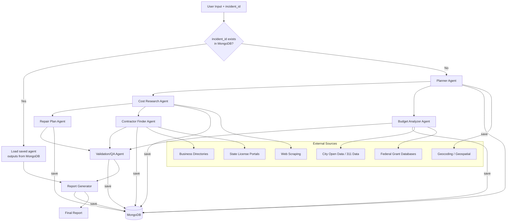

# Multi-Agent Infrastructure Reporting Workflow

## Overview

This document defines an enhanced 7-agent pipeline for generating public infrastructure repair reports. Each agent is a distinct FastAPI service component with defined inputs, outputs, and responsibilities. Each stage must utilize Gemini's API LLMs for `gemini-3-flash-preview`.

When an `incident_id` is provided, each agent's output is persisted to MongoDB as it completes. If the same `incident_id` is submitted again, the orchestrator loads all previously saved agent outputs from MongoDB and skips re-execution for any step that already has a stored result — only running agents whose data is missing or explicitly marked for refresh.

---

## User Inputs

| Field | Type | Required | Description |
|-------|------|----------|-------------|
| `incident_id` | string | No | Unique identifier for the infrastructure incident. If provided and a prior run exists, saved MongoDB data is returned instead of re-running agents |
| `issue_type` | string | Yes | Infrastructure problem (pothole, streetlight, graffiti, sidewalk, signal, etc.) |
| `location` | string | Yes | City and state (e.g., "Chicago, IL") |
| `fiscal_year` | integer | Yes | Year of interest (e.g., 2025) |
| `image_url` | string | No | Optional image of the issue for severity assessment |
| `image_base64` | string | No | Optional base64-encoded image for multimodal analysis |

---

## Workflow Architecture



---

## Caching Layer

Cost data and contractor listings do not need to be re-scraped on every run. A Redis or file-based cache with TTL rules should be applied across agents to prevent redundant external calls and reduce latency.

| Data Type | Cache TTL |
|-----------|-----------|
| Material costs (Home Depot, Lowe's) | 30 days |
| Contractor listings | 7 days |
| Budget / open data figures | 14 days |
| 311 complaint history | 3 days |
| Geocoding results | 90 days |

Cache keys should be scoped by `(location, issue_type, fiscal_year)` where applicable.

---

## MongoDB Persistence

### Purpose

When an `incident_id` is present on a request, the orchestrator uses MongoDB as the source of truth for that incident's agent outputs. Each agent writes its result to a dedicated collection immediately upon completion. On subsequent requests for the same `incident_id`, the orchestrator checks each agent's collection for an existing document before deciding whether to run or skip that agent.

This enables partial re-runs — for example, re-running only the Contractor Finder while reusing all other saved steps — as well as full recovery if a pipeline run is interrupted mid-way.

---

### Database & Collections

**Database name:** `infrastructure_reports`

| Collection | Stores | Keyed By |
|------------|--------|----------|
| `incidents` | Top-level incident record and pipeline run status | `incident_id` |
| `agent_planner` | Planner Agent output | `incident_id` |
| `agent_cost_research` | Cost Research Agent output | `incident_id` |
| `agent_repair_plan` | Repair Plan Agent output | `incident_id` |
| `agent_contractor` | Contractor Finder Agent output | `incident_id` |
| `agent_budget` | Budget Analyzer Agent output | `incident_id` |
| `agent_validation` | Validation/QA Agent output | `incident_id` |
| `agent_report` | Final Report Generator output | `incident_id` |

---

### `incidents` Collection Schema

This is the master record created when a new `incident_id` is first submitted. It tracks the overall pipeline run state and links to all agent step results.

```json
{
  "_id": "INC-20250115-CHI-001",
  "incident_id": "INC-20250115-CHI-001",
  "created_at": "2025-01-15T10:20:00Z",
  "updated_at": "2025-01-15T10:31:00Z",
  "status": "complete",
  "inputs": {
    "issue_type": "pothole",
    "location": "Chicago, IL",
    "fiscal_year": 2025,
    "image_url": null
  },
  "pipeline_run": {
    "started_at": "2025-01-15T10:20:00Z",
    "completed_at": "2025-01-15T10:31:00Z",
    "total_duration_ms": 66000,
    "agents_completed": ["planner", "cost_research", "budget", "repair_plan", "contractor", "validation", "report"],
    "agents_skipped": [],
    "agents_failed": []
  },
  "report_url": "https://reports.example.com/INC-20250115-CHI-001"
}
```

---

### Agent Step Collection Schema

Every agent collection follows the same document structure, wrapping the agent's output payload inside the standard metadata envelope:

```json
{
  "_id": "INC-20250115-CHI-001",
  "incident_id": "INC-20250115-CHI-001",
  "agent_id": "cost_research",
  "executed_at": "2025-01-15T10:23:00Z",
  "duration_ms": 3400,
  "model_used": "gemini-3-flash-preview",
  "tokens_used": 1820,
  "confidence": 0.82,
  "run_count": 1,
  "data": {
    "material_costs": [],
    "labor_costs": [],
    "time_estimates": [],
    "total_cost_estimate": {}
  }
}
```

The `run_count` field increments each time that agent step is re-executed for the same `incident_id`, preserving a history of retries or forced refreshes.

---

### Orchestrator Decision Logic

```
function run_pipeline(incident_id, inputs):

  # Step 1 — Check if incident exists
  incident = mongo.incidents.find_one({ incident_id })

  if incident and incident.status == "complete":
    return load_final_report(incident_id)   # Return saved report immediately

  if not incident:
    mongo.incidents.insert_one({ incident_id, status: "running", inputs, created_at: now() })

  # Step 2 — For each agent, check if its step output already exists
  for each agent_step in [planner, cost_research, budget, repair_plan, contractor, validation, report]:

    saved = mongo[agent_step.collection].find_one({ incident_id })

    if saved and saved.confidence >= 0.6:
      agent_step.output = saved.data    # Reuse saved result, skip execution
      log("Skipped agent: " + agent_step.name + " (loaded from MongoDB)")

    else:
      result = agent_step.run(inputs)   # Execute agent
      mongo[agent_step.collection].replace_one(
        { incident_id },
        { ...metadata_envelope, data: result },
        upsert=True
      )
      agent_step.output = result

  # Step 3 — Mark incident as complete
  mongo.incidents.update_one(
    { incident_id },
    { status: "complete", updated_at: now(), report_url: "..." }
  )
```

---

### Forced Refresh

To force re-execution of a specific agent step (e.g., after contractor data goes stale), the request can include a `force_refresh` array:

```json
{
  "incident_id": "INC-20250115-CHI-001",
  "force_refresh": ["contractor", "budget"]
}
```

The orchestrator will delete the existing MongoDB documents for those agent collections and re-run only those steps, reusing all others as normal.

---

### Indexes

The following indexes must be created at application startup:

```python
# Unique index on incident_id for all collections
for collection in [
    "incidents", "agent_planner", "agent_cost_research",
    "agent_repair_plan", "agent_contractor", "agent_budget",
    "agent_validation", "agent_report"
]:
    db[collection].create_index("incident_id", unique=True)

# TTL index on incidents for auto-expiry (optional, e.g. 1 year)
db["incidents"].create_index("created_at", expireAfterSeconds=31536000)
```

---

Every agent output must be wrapped in a standard metadata envelope for observability, cost tracking, and auditing:

```json
{
  "agent_id": "cost_research",
  "executed_at": "2025-01-15T10:28:00Z",
  "duration_ms": 3400,
  "model_used": "gemini-3-flash-preview",
  "tokens_used": 1820,
  "confidence": 0.82,
  "data": { }
}
```

| Field | Description |
|-------|-------------|
| `agent_id` | Unique identifier for the agent |
| `executed_at` | ISO 8601 timestamp of execution |
| `duration_ms` | Execution time in milliseconds |
| `model_used` | Gemini model version used |
| `tokens_used` | Token count for cost tracking |
| `confidence` | 0.0–1.0 score for downstream QA validation |
| `data` | The agent's actual output payload |

---

## Feedback Loop & Retry Logic

If an agent returns a `confidence` score below `0.6`, the orchestrator should apply the following retry strategy before proceeding:

1. Retry the agent with alternate search queries (up to 2 retries)
2. If confidence remains low after retries, proceed with a `low_confidence_disclaimer` flag set to `true` in the final report
3. If an agent fails entirely, mark that section as `"status": "unavailable"` and continue pipeline execution — a partial report is more useful than a failed one

---

## Agent Specifications

---

### Agent 1: Planner Agent

**Purpose:** Parse user input, infer issue severity, generate structured tasks, and produce search queries for downstream agents. If an image is provided, pass it to Gemini for multimodal severity assessment.

**Input:**
- `issue_type`: string
- `location`: string
- `fiscal_year`: integer
- `image_url` *(optional)*: string
- `image_base64` *(optional)*: string

**Output:**
```json
{
  "search_queries": {
    "cost_research": ["pothole repair cost Chicago 2025", "asphalt patching labor cost per square foot"],
    "contractor_search": ["pothole repair contractors Chicago IL", "local paving companies Chicago"],
    "budget_data": ["Chicago infrastructure budget 2025", "CDOT pavement repair allocation"]
  },
  "tasks_list": [
    {"agent": "cost_research", "priority": 1},
    {"agent": "budget_analyzer", "priority": 1},
    {"agent": "contractor_finder", "priority": 2},
    {"agent": "repair_plan", "priority": 2}
  ],
  "parsed_issue": {
    "category": "pavement",
    "subtype": "pothole",
    "severity_inferred": "high",
    "severity_source": "image_analysis",
    "urgency_flags": ["near_school", "high_traffic_corridor"]
  },
  "geospatial": {
    "coordinates": {"lat": 41.8781, "lng": -87.6298},
    "neighborhood": "Loop",
    "district": "Ward 42",
    "geocoder": "census"
  }
}
```

**Notes:**
- Severity is inferred dynamically via Gemini (from image if provided, or from issue type heuristics) rather than hardcoded as `"medium"`
- Urgency flags such as `near_school` or `near_hospital` adjust downstream task priorities
- Geocoding converts the `location` string into coordinates using the Census geocoder or Google Maps API, enriching all downstream agents with geospatial context

**External Data Sources:**
- Google Maps API / Census Geocoder (coordinates and neighborhood)
- Gemini multimodal API (optional image severity assessment)

---

### Agent 2: Cost Research Agent

**Purpose:** Research material, labor, and time costs for the specific issue type using web scraping. Web scrape websites like Lowe's, Home Depot, Menards, and other construction and home goods websites. Include historical cost benchmarks for year-over-year comparison.

**Input:**
- `search_queries`: list of strings
- `issue_type`: string
- `location`: string

**Output:**
```json
{
  "material_costs": [
    {"item": "Hot mix asphalt", "unit": "per ton", "cost_low": 85, "cost_high": 120, "source": "regional_aggregates"},
    {"item": "Cold patch asphalt", "unit": "per bag", "cost_low": 18, "cost_high": 35, "source": "home_depot"}
  ],
  "labor_costs": [
    {"role": "Laborer", "hourly_rate_low": 25, "hourly_rate_high": 45},
    {"role": "Equipment Operator", "hourly_rate_low": 35, "hourly_rate_high": 60}
  ],
  "time_estimates": [
    {"task": "Small pothole repair (<2ft)", "hours_low": 0.5, "hours_high": 1.5},
    {"task": "Medium pothole repair (2-5ft)", "hours_low": 1.5, "hours_high": 3},
    {"task": "Large pothole repair (>5ft)", "hours_low": 3, "hours_high": 6}
  ],
  "historical_benchmarks": [
    {"year": 2023, "avg_cost": 280, "source": "city_bid_archive"},
    {"year": 2024, "avg_cost": 310, "source": "city_bid_archive"}
  ],
  "total_cost_estimate": {
    "low": 150,
    "high": 450,
    "currency": "USD"
  },
  "sources": [
    {"url": "https://example.com/cost-guide", "accessed": "2025-01-15", "reliability": "high"}
  ]
}
```

**External Data Sources:**
- Web scraping: Home Depot, Lowe's for material costs
- Industry reports: Construction Cost Data
- Municipal bid sheets for labor rates
- Regional aggregate suppliers
- City bid archives for historical benchmarks

---

### Agent 3: Repair Plan Agent

**Purpose:** Generate a general repair plan based on issue type and cost research.

**Input:**
- `issue_type`: string
- `location`: string
- `cost_estimates`: object from Agent 2

**Output:**
```json
{
  "repair_phases": [
    {
      "phase": 1,
      "name": "Site Assessment",
      "description": "Evaluate pothole depth, area, and surrounding pavement condition",
      "duration_hours": 0.5,
      "materials_needed": ["measuring tape", "core sample tool"],
      "prerequisites": []
    },
    {
      "phase": 2,
      "name": "Surface Preparation",
      "description": "Clean debris, remove loose material, square off edges",
      "duration_hours": 1,
      "materials_needed": ["jackhammer", "broom", "air compressor"],
      "prerequisites": ["phase_1"]
    },
    {
      "phase": 3,
      "name": "Patching",
      "description": "Apply asphalt patch material and compact",
      "duration_hours": 1.5,
      "materials_needed": ["asphalt mix", "compactor", "tamper"],
      "prerequisites": ["phase_2"]
    },
    {
      "phase": 4,
      "name": "Curing & Quality Check",
      "description": "Allow to cure, inspect for uniformity",
      "duration_hours": 0.5,
      "materials_needed": [],
      "prerequisites": ["phase_3"]
    }
  ],
  "recommended_method": "hot mix asphalt overlay for lasting repair",
  "alternative_methods": [
    {"method": "cold patch", "pros": "quick fix", "cons": "temporary", "best_for": "winter emergency repairs"}
  ],
  "permits_required": false,
  "safety_considerations": ["traffic control", "PPE required", "utilities clearance"]
}
```

**External Data Sources:** None (expert knowledge base)

---

### Agent 4: Contractor Finder Agent

**Purpose:** Find local businesses/contractors capable of performing the repair. Web scrape and use Gemini LLMs for searching local construction and contractor companies. Validate contractor licenses against state licensing portals before including results.

**Input:**
- `search_queries`: list of contractor search queries
- `issue_type`: string
- `location`: string

**Output:**
```json
{
  "contractors": [
    {
      "name": "Chicago Paving Co.",
      "address": "123 Main St, Chicago, IL",
      "phone": "312-555-0100",
      "rating": 4.5,
      "review_count": 230,
      "services": ["asphalt repair", "pothole patching", "sealcoating"],
      "estimated_response_time": "2-3 days",
      "license": {
        "number": "IL-CON-004821",
        "status": "active",
        "verified_via": "illinois_contractor_license_portal",
        "verified_at": "2025-01-15"
      },
      "source": "yellow_pages"
    }
  ],
  "search_sources_used": ["yellow_pages", "yelp", "city_vendor_list"],
  "filters_applied": ["licensed", "insured", "active_in_area"]
}
```

**Notes:**
- Before including any contractor in results, the agent must verify license status via the relevant state contractor license lookup portal (most states expose public REST APIs for this)
- Contractors with expired, suspended, or unverifiable licenses must be excluded or flagged

**External Data Sources:**
- Yellow Pages / web scraping
- Yelp business directory
- City vendor / pre-qualified contractor lists
- Better Business Bureau
- State contractor license verification portals

---

### Agent 5: Budget Analyzer Agent

**Purpose:** Analyze the fiscal year budget for feasibility and allocation recommendations. Use Gemini LLM and web scraping to find and analyze allocations. Additionally, identify any federal or state grant programs the issue may qualify for.

**Input:**
- `fiscal_year`: integer
- `location`: string
- `cost_estimates`: object from Agent 2

**Output:**
```json
{
  "fiscal_year": 2025,
  "budget_analysis": {
    "total_infrastructure_budget": 150000000,
    "allocated_to_issue_type": 8500000,
    "remaining": 14150000,
    "source": "Chicago Open Data Portal"
  },
  "feasibility": {
    "within_budget": true,
    "cost_as_percentage_of_allocation": 0.005,
    "recommendation": "proceed"
  },
  "grant_opportunities": [
    {
      "program": "RAISE Grants (USDOT)",
      "eligible": true,
      "max_award": 25000000,
      "deadline": "2025-04-14",
      "source": "grants.gov"
    },
    {
      "program": "Illinois State DOT Pavement Program",
      "eligible": true,
      "max_award": 500000,
      "deadline": "2025-06-01",
      "source": "idot.illinois.gov"
    }
  ],
  "recommendations": [
    "Request allocation from FY2025 pavement maintenance fund",
    "Consider bundling with adjacent repairs for bulk discount",
    "Apply for RAISE grant to offset cost of large-scale repairs"
  ],
  "alternatives_if_over_budget": [
    {"option": "defer_to_next_fiscal_year", "reason": "not critical"},
    {"option": "request_emergency_allocation", "reason": "safety hazard"},
    {"option": "use_cold_patch_temporary", "cost_savings": "60%"}
  ]
}
```

**Notes:**
- The `grant_opportunities` section checks whether the issue type qualifies for IIJA, RAISE, or state DOT programs
- Multi-jurisdiction locations (e.g., border cities, county vs. municipal) must be handled by branching the budget lookup across all relevant entities and merging results

**External Data Sources:**
- City Open Data Portal (budget data)
- Municipal budget PDFs / documents
- State transparency portals
- grants.gov (federal grant database)
- State DOT program listings

---

### Agent 6: Validation / QA Agent *(New)*

**Purpose:** Cross-check all upstream agent outputs before report generation. Verify cost estimates are within realistic ranges, contractor data is not stale, budget figures match sourced documents, and flag any low-confidence or missing data sections.

**Input:**
- All outputs from Agents 1–5 (including agent metadata envelopes)

**Output:**
```json
{
  "validation_summary": {
    "overall_status": "pass_with_warnings",
    "agents_reviewed": 5,
    "issues_found": 2
  },
  "checks": [
    {
      "agent": "cost_research",
      "check": "cost_range_realistic",
      "status": "pass",
      "notes": "Estimates within expected range for Chicago metro area"
    },
    {
      "agent": "contractor_finder",
      "check": "license_verified",
      "status": "warning",
      "notes": "1 contractor could not be verified; excluded from final report"
    },
    {
      "agent": "budget_analyzer",
      "check": "budget_source_accessible",
      "status": "pass",
      "notes": "Chicago Open Data Portal responded successfully"
    },
    {
      "agent": "cost_research",
      "check": "data_freshness",
      "status": "warning",
      "notes": "Material cost data is 28 days old; approaching cache TTL"
    }
  ],
  "low_confidence_sections": ["contractor_finder"],
  "proceed_to_report": true
}
```

**Validation Rules:**
- Cost estimates must fall within ±50% of historical benchmarks; flag outliers
- Contractor data older than 7 days triggers a freshness warning
- Any agent with `confidence < 0.6` is flagged and its section marked with a disclaimer in the final report
- Budget figures must be cross-referenced against at least one verifiable source URL

**External Data Sources:** None (cross-references upstream agent outputs)

---

### Agent 7: Report Generator Agent

**Purpose:** Synthesize all agent outputs into a final structured report. Use Gemini LLM. Incorporate QA validation results and surface confidence/source transparency metadata.

**Input:**
- All outputs from Agents 1–6

**Output:**
```json
{
  "report_metadata": {
    "generated_at": "2025-01-15T10:30:00Z",
    "fiscal_year": 2025,
    "location": "Chicago, IL",
    "issue_type": "pothole",
    "report_id": "RPT-20250115-CHI-001",
    "report_url": "https://reports.example.com/RPT-20250115-CHI-001"
  },
  "executive_summary": {
    "estimated_cost_range": "$150-$450",
    "recommended_timeline": "3-5 business days",
    "budget_feasible": true,
    "contractors_found": 5,
    "grant_opportunities_available": 2,
    "low_confidence_disclaimer": false
  },
  "sections": {
    "cost_analysis": {},
    "repair_plan": {},
    "contractors": {},
    "budget": {},
    "grants": {},
    "311_complaint_history": {},
    "sources": []
  },
  "source_reliability": [
    {"source": "Chicago Open Data Portal", "type": "official", "reliability": "high"},
    {"source": "Home Depot scrape", "type": "scraped", "reliability": "medium"},
    {"source": "Yellow Pages scrape", "type": "scraped", "reliability": "medium"}
  ],
  "export_formats": ["markdown", "pdf", "html"]
}
```

**Notes:**
- `report_url` provides a shareable public link to the generated report
- `source_reliability` rates each data source so readers understand the confidence level of each section — official open data receives `"high"`, scraped sources receive `"medium"`, and unverifiable sources receive `"low"`
- If `low_confidence_disclaimer` is `true`, a prominent disclaimer banner is rendered at the top of all export formats

**External Data Sources:** None (synthesis)

---

## FastAPI Integration

### Routes

#### POST `/api/v1/workflow/infrastructure-report`

Initiates a new report generation job.

**Request Model:**
```python
class InfrastructureReportRequest(BaseModel):
    incident_id: Optional[str] = Field(None, description="Unique incident identifier. If provided and a prior run exists in MongoDB, saved results are returned without re-running agents")
    issue_type: str = Field(..., description="Type of infrastructure issue")
    location: str = Field(..., description="City and state")
    fiscal_year: int = Field(..., description="Fiscal year for budget analysis")
    image_url: Optional[str] = Field(None, description="Optional image URL for severity assessment")
    image_base64: Optional[str] = Field(None, description="Optional base64-encoded image")
    force_refresh: Optional[List[str]] = Field(None, description="List of agent names to re-run even if saved data exists (e.g. ['contractor', 'budget'])")
```

**Response Model:**
```python
class InfrastructureReportResponse(BaseModel):
    report_id: str
    incident_id: Optional[str]   # Echoed back if provided in the request
    status: str
    progress: int                # 0-100
    cache_hit: bool              # True if results were loaded from MongoDB
    agents_skipped: List[str]    # Agent steps reused from saved MongoDB data
    result: Optional[dict]       # Final report when complete
```

---

#### GET `/api/v1/workflow/infrastructure-report/{report_id}`

Poll for the status of an in-progress report. Clients should use this to avoid holding long HTTP connections open.

```python
class ReportStatusResponse(BaseModel):
    report_id: str
    incident_id: Optional[str]
    status: str           # "pending" | "running" | "complete" | "failed"
    progress: int         # 0-100
    current_agent: str    # e.g., "cost_research"
    cache_hit: bool
    agents_completed: List[str]
    agents_skipped: List[str]
    agents_failed: List[str]
    result: Optional[dict]
    error: Optional[str]
```

---

#### GET `/api/v1/workflow/infrastructure-report/incident/{incident_id}`

Retrieve the full saved record for a known incident directly from MongoDB, including all individual agent step outputs.

```python
class IncidentDetailResponse(BaseModel):
    incident_id: str
    status: str
    inputs: dict
    pipeline_run: dict
    agent_outputs: dict    # Keys are agent names; values are their saved data payloads
    report_url: Optional[str]
    created_at: datetime
    updated_at: datetime
```

---

#### WebSocket `/ws/v1/workflow/infrastructure-report/{report_id}`

Real-time streaming progress updates. Emits a message each time an agent completes:

```json
{
  "event": "agent_complete",
  "agent_id": "cost_research",
  "progress": 33,
  "timestamp": "2025-01-15T10:28:45Z"
}
```

---

## Agent Service Structure

```
backend/app/
├── agents/
│   ├── __init__.py
│   ├── base.py              # Abstract base agent class
│   ├── planner.py           # Agent 1
│   ├── cost_research.py     # Agent 2
│   ├── repair_plan.py       # Agent 3
│   ├── contractor.py        # Agent 4
│   ├── budget.py            # Agent 5
│   ├── validation.py        # Agent 6
│   └── report_gen.py        # Agent 7
├── services/
│   ├── __init__.py
│   ├── web_scraper.py       # BeautifulSoup utilities (with rate limiting)
│   ├── open_data.py         # City data API client
│   ├── geocoder.py          # Geocoding & geospatial enrichment
│   ├── license_verify.py    # State contractor license lookup
│   ├── grant_search.py      # Federal/state grant matching
│   ├── cache.py             # Redis/file-based cache with TTL management
│   └── mongo.py             # MongoDB client, collection accessors, and index setup
└── workflows/
    ├── __init__.py
    └── infrastructure.py    # Orchestration logic: incident_id check, per-step save/load, retry/fallback
```

---

## Web Scraping Ethics & Rate Limiting

All scraping agents must comply with the following rules:

| Rule | Requirement |
|------|-------------|
| `robots.txt` | Always respect `robots.txt` before scraping any domain |
| Crawl delay | Minimum 2-second delay between requests per domain |
| User-Agent | Rotate User-Agent strings across a defined pool |
| Proxy rotation | Use a proxy pool for domains with aggressive bot detection (e.g., Home Depot) |
| Per-domain rate limit | Max 10 requests/minute per domain |
| Failure handling | On 429 or 503, back off exponentially and retry up to 3 times |

---

## Environment Configuration

All configuration must be stored in environment variables. The following are required at runtime:

```env
# Gemini
GEMINI_API_KEY=

# MongoDB
MONGODB_URI=mongodb://localhost:27017
MONGODB_DB_NAME=infrastructure_reports

# Geocoding
GOOGLE_MAPS_API_KEY=          # or leave blank to use Census geocoder

# Caching
REDIS_URL=redis://localhost:6379
CACHE_DEFAULT_TTL_DAYS=7

# Scraping
SCRAPING_PROXY_URL=           # Optional; recommended for production
SCRAPING_USER_AGENT_POOL=     # Comma-separated list of User-Agent strings

# Report Storage
REPORT_BASE_URL=https://reports.example.com
REPORT_STORAGE_PATH=/var/reports
```

---

## Implementation Priorities

| Phase | Agents / Features |
|-------|-------------------|
| **Phase 1** | Core agents: Planner, Cost Research, Report Generator |
| **Phase 2** | MongoDB persistence: `incidents` collection, per-agent collections, orchestrator save/load logic, `incident_id` routing |
| **Phase 3** | External integrations: web scraping, open data, caching layer |
| **Phase 4** | Advanced agents: Repair Plan, Contractor (with license verification), Budget (with grant matching) |
| **Phase 5** | Validation/QA Agent, retry logic, confidence scoring, `force_refresh` support |
| **Phase 6** | Report formatting (PDF, HTML), shareable report URLs, WebSocket streaming |

---

## Dependencies

```yaml
# Core
beautifulsoup4==4.12.0
lxml==5.1.0
aiohttp==3.9.0          # Async HTTP for APIs and scraping

# Report generation
weasyprint==60.1        # PDF generation
jinja2==3.1.3           # HTML templating

# Database
motor==3.3.2            # Async MongoDB driver for FastAPI
pymongo==4.6.0          # Sync MongoDB driver (used for index setup at startup)

# Caching
redis==5.0.0

# Geospatial
geopy==2.4.0            # Geocoding abstraction layer

# Utilities
fake-useragent==1.4.0   # User-Agent rotation for scraping
tenacity==8.2.3         # Retry logic with exponential backoff
```

---

## External APIs & Data Sources

| Source | Type | Purpose | Auth Required |
|--------|------|---------|---------------|
| MongoDB | Database | Incident persistence, agent step storage, run history | Yes (connection string) |
| City Open Data Portal | REST API | Budget data | No |
| 311 Open Data (city-specific) | REST API | Complaint history & resolution times | No |
| Census Geocoder | REST API | Coordinate lookup | No |
| Google Maps API | REST API | Geocoding (fallback) | Yes |
| Yellow Pages | Web Scraping | Contractor listings | No |
| Yelp | Web Scraping | Business reviews | No |
| Home Depot | Web Scraping | Material costs | No |
| Lowe's / Menards | Web Scraping | Material costs | No |
| Municipal websites | Web Scraping | Bid sheets, labor rates | No |
| State License Portals | REST API / Scraping | Contractor license verification | No |
| grants.gov | REST API | Federal grant opportunities | No |
| State DOT websites | Web Scraping | State grant programs | No |
