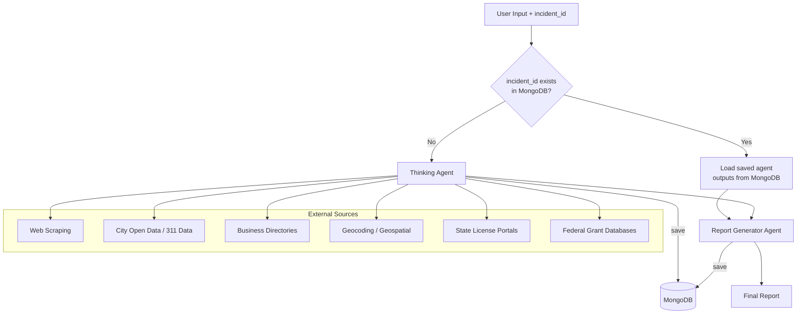

# Multi-Agent Infrastructure Reporting Workflow

## Overview

This document defines a streamlined 2-agent pipeline for generating public infrastructure repair reports. Each agent is a distinct FastAPI service component with defined inputs, outputs, and responsibilities. Both agents utilize Gemini's API LLMs for `gemini-3-flash-preview`.

When an `incident_id` is provided, each agent's output is persisted to MongoDB as it completes. If the same `incident_id` is submitted again, the orchestrator loads all previously saved agent outputs from MongoDB and skips re-execution for any step that already has a stored result — only running agents whose data is missing or explicitly marked for refresh.

Do not generate or hardcode fake or generated data, use the Gemini API to prompt for the agent.
---

## User Inputs

| Field | Type | Required | Description |
|-------|------|----------|-------------|
| `incident_id` | string | No | Unique identifier for the infrastructure incident. If provided and a prior run exists, saved MongoDB data is returned instead of re-running agents |
| `issue_type` | string | Yes | Infrastructure problem (pothole, streetlight, graffiti, sidewalk, signal, etc.) |
| `location` | string | Yes | City and state (e.g., "Chicago, IL") |
| `fiscal_year` | integer | Yes | Year of interest (e.g., 2025) |
| `image_url` | string | No | Optional image of the issue for severity assessment |
| `image_base64` | string | No | Optional base64-encoded image for multimodal analysis |

---

## Workflow Architecture



---


## MongoDB Persistence

### Purpose

When an `incident_id` is present on a request, the orchestrator uses MongoDB as the source of truth for that incident's agent outputs. Each agent writes its result to a dedicated collection immediately upon completion. On subsequent requests for the same `incident_id`, the orchestrator checks each agent's collection for an existing document before deciding whether to run or skip that agent.

This enables partial re-runs — for example, re-running only the Report Generator while reusing the saved Thinking Agent output — as well as full recovery if a pipeline run is interrupted mid-way.

---

### Database & Collections

**Database name:** `infrastructure_reports`

| Collection | Stores | Keyed By |
|------------|--------|----------|
| `incidents` | Top-level incident record and pipeline run status | `incident_id` |
| `agent_thinking` | Thinking Agent output | `incident_id` |
| `agent_report` | Report Generator Agent output | `incident_id` |

---

### `incidents` Collection Schema

This is the master record created when a new `incident_id` is first submitted. It tracks the overall pipeline run state and links to all agent step results.

```json
{
  "_id": "INC-20250115-CHI-001",
  "incident_id": "INC-20250115-CHI-001",
  "created_at": "2025-01-15T10:20:00Z",
  "updated_at": "2025-01-15T10:31:00Z",
  "status": "complete",
  "inputs": {
    "issue_type": "pothole",
    "location": "Chicago, IL",
    "fiscal_year": 2025,
    "image_url": null
  },
  "pipeline_run": {
    "started_at": "2025-01-15T10:20:00Z",
    "completed_at": "2025-01-15T10:31:00Z",
    "total_duration_ms": 66000,
    "agents_completed": ["thinking", "report"],
    "agents_skipped": [],
    "agents_failed": []
  }
}
```

---

### Agent Step Collection Schema

Every agent collection follows the same document structure, wrapping the agent's output payload inside the standard metadata envelope:

```json
{
  "_id": "INC-20250115-CHI-001",
  "incident_id": "INC-20250115-CHI-001",
  "agent_id": "thinking",
  "executed_at": "2025-01-15T10:23:00Z",
  "duration_ms": 3400,
  "model_used": "gemini-3-flash-preview",
  "tokens_used": 1820,
  "confidence": 0.82,
  "run_count": 1,
  "data": { }
}
```

The `run_count` field increments each time that agent step is re-executed for the same `incident_id`, preserving a history of retries or forced refreshes.

---

### Orchestrator Decision Logic

```
function run_pipeline(incident_id, inputs):

  # Step 1 — Check if incident exists
  incident = mongo.incidents.find_one({ incident_id })

  if incident and incident.status == "complete":
    return load_final_report(incident_id)   # Return saved report immediately

  if not incident:
    mongo.incidents.insert_one({ incident_id, status: "running", inputs, created_at: now() })

  # Step 2 — For each agent, check if its step output already exists
  for each agent_step in [thinking, report]:

    saved = mongo[agent_step.collection].find_one({ incident_id })

    if saved and saved.confidence >= 0.6:
      agent_step.output = saved.data    # Reuse saved result, skip execution
      log("Skipped agent: " + agent_step.name + " (loaded from MongoDB)")

    else:
      result = agent_step.run(inputs)   # Execute agent
      mongo[agent_step.collection].replace_one(
        { incident_id },
        { ...metadata_envelope, data: result },
        upsert=True
      )
      agent_step.output = result

  # Step 3 — Mark incident as complete
  mongo.incidents.update_one(
    { incident_id },
    { status: "complete", updated_at: now(), report_url: "..." }
  )
```

---

### Forced Refresh

To force re-execution of a specific agent step, the request can include a `force_refresh` array:

```json
{
  "incident_id": "INC-20250115-CHI-001",
  "force_refresh": ["thinking", "report"]
}
```

The orchestrator will delete the existing MongoDB documents for those agent collections and re-run only those steps, reusing any others as normal.

---

### Indexes

The following indexes must be created at application startup:

```python
# Unique index on incident_id for all collections
for collection in ["incidents", "agent_thinking", "agent_report"]:
    db[collection].create_index("incident_id", unique=True)

# TTL index on incidents for auto-expiry (optional, e.g. 1 year)
db["incidents"].create_index("created_at", expireAfterSeconds=31536000)
```

---

Every agent output must be wrapped in a standard metadata envelope for observability, cost tracking, and auditing:

```json
{
  "agent_id": "thinking",
  "executed_at": "2025-01-15T10:28:00Z",
  "duration_ms": 3400,
  "model_used": "gemini-3-flash-preview",
  "tokens_used": 1820,
  "confidence": 0.82,
  "data": { }
}
```

| Field | Description |
|-------|-------------|
| `agent_id` | Unique identifier for the agent |
| `executed_at` | ISO 8601 timestamp of execution |
| `duration_ms` | Execution time in milliseconds |
| `model_used` | Gemini model version used |
| `tokens_used` | Token count for cost tracking |
| `confidence` | 0.0–1.0 score for QA validation |
| `data` | The agent's actual output payload |

---

## Feedback Loop & Retry Logic

If an agent returns a `confidence` score below `0.6`, the orchestrator should apply the following retry strategy before proceeding:

1. Retry the agent with alternate search queries (up to 2 retries)
2. If confidence remains low after retries, proceed with a `low_confidence_disclaimer` flag set to `true` in the final report
3. If an agent fails entirely, mark all affected sections as `"status": "unavailable"` and continue — a partial report is more useful than a failed one

---

## Agent Specifications

---

### Agent 1: Thinking Agent

**Purpose:** The Thinking Agent is a unified reasoning and data-gathering agent. It combines planning, cost research, repair planning, contractor discovery, and budget analysis into a single comprehensive pass. It parses user input, infers issue severity, geocodes the location, scrapes material and labor cost data, generates a phased repair plan, discovers and license-verifies local contractors, and analyzes the fiscal year budget along with applicable grant programs — all before handing off to the Report Generator.

**Input:**
- `issue_type`: string
- `location`: string
- `fiscal_year`: integer
- `image_url` *(optional)*: string
- `image_base64` *(optional)*: string

**Output:**
```json
{
  "parsed_issue": {
    "category": "pavement",
    "subtype": "pothole",
    "severity_inferred": "high",
    "severity_source": "image_analysis",
    "urgency_flags": ["near_school", "high_traffic_corridor"]
  },
  "geospatial": {
    "coordinates": {"lat": 41.8781, "lng": -87.6298},
    "neighborhood": "Loop",
    "district": "Ward 42",
    "geocoder": "census"
  },
  "search_queries_used": {
    "cost_research": ["pothole repair cost Chicago 2025", "asphalt patching labor cost per square foot"],
    "contractor_search": ["pothole repair contractors Chicago IL", "local paving companies Chicago"],
    "budget_data": ["Chicago infrastructure budget 2025", "CDOT pavement repair allocation"]
  },
  "material_costs": [
    {"item": "Hot mix asphalt", "unit": "per ton", "cost_low": 85, "cost_high": 120, "source": "regional_aggregates"},
    {"item": "Cold patch asphalt", "unit": "per bag", "cost_low": 18, "cost_high": 35, "source": "home_depot"}
  ],
  "labor_costs": [
    {"role": "Laborer", "hourly_rate_low": 25, "hourly_rate_high": 45},
    {"role": "Equipment Operator", "hourly_rate_low": 35, "hourly_rate_high": 60}
  ],
  "time_estimates": [
    {"task": "Small pothole repair (<2ft)", "hours_low": 0.5, "hours_high": 1.5},
    {"task": "Medium pothole repair (2-5ft)", "hours_low": 1.5, "hours_high": 3},
    {"task": "Large pothole repair (>5ft)", "hours_low": 3, "hours_high": 6}
  ],
  "historical_benchmarks": [
    {"year": 2023, "avg_cost": 280, "source": "city_bid_archive"},
    {"year": 2024, "avg_cost": 310, "source": "city_bid_archive"}
  ],
  "total_cost_estimate": {
    "low": 150,
    "high": 450,
    "currency": "USD"
  },
  "repair_phases": [
    {
      "phase": 1,
      "name": "Site Assessment",
      "description": "Evaluate pothole depth, area, and surrounding pavement condition",
      "duration_hours": 0.5,
      "materials_needed": ["measuring tape", "core sample tool"],
      "prerequisites": []
    },
    {
      "phase": 2,
      "name": "Surface Preparation",
      "description": "Clean debris, remove loose material, square off edges",
      "duration_hours": 1,
      "materials_needed": ["jackhammer", "broom", "air compressor"],
      "prerequisites": ["phase_1"]
    },
    {
      "phase": 3,
      "name": "Patching",
      "description": "Apply asphalt patch material and compact",
      "duration_hours": 1.5,
      "materials_needed": ["asphalt mix", "compactor", "tamper"],
      "prerequisites": ["phase_2"]
    },
    {
      "phase": 4,
      "name": "Curing & Quality Check",
      "description": "Allow to cure, inspect for uniformity",
      "duration_hours": 0.5,
      "materials_needed": [],
      "prerequisites": ["phase_3"]
    }
  ],
  "recommended_method": "hot mix asphalt overlay for lasting repair",
  "alternative_methods": [
    {"method": "cold patch", "pros": "quick fix", "cons": "temporary", "best_for": "winter emergency repairs"}
  ],
  "permits_required": false,
  "safety_considerations": ["traffic control", "PPE required", "utilities clearance"],
  "contractors": [
    {
      "name": "Chicago Paving Co.",
      "address": "123 Main St, Chicago, IL",
      "phone": "312-555-0100",
      "rating": 4.5,
      "review_count": 230,
      "services": ["asphalt repair", "pothole patching", "sealcoating"],
      "estimated_response_time": "2-3 days",
      "license": {
        "number": "IL-CON-004821",
        "status": "active",
        "verified_via": "illinois_contractor_license_portal",
        "verified_at": "2025-01-15"
      },
      "source": "yellow_pages"
    }
  ],
  "contractor_search_sources_used": ["yellow_pages", "yelp", "city_vendor_list"],
  "contractor_filters_applied": ["licensed", "insured", "active_in_area"],
  "budget_analysis": {
    "fiscal_year": 2025,
    "total_infrastructure_budget": 150000000,
    "allocated_to_issue_type": 8500000,
    "remaining": 14150000,
    "source": "Chicago Open Data Portal"
  },
  "feasibility": {
    "within_budget": true,
    "cost_as_percentage_of_allocation": 0.005,
    "recommendation": "proceed"
  },
  "grant_opportunities": [
    {
      "program": "RAISE Grants (USDOT)",
      "eligible": true,
      "max_award": 25000000,
      "deadline": "2025-04-14",
      "source": "grants.gov"
    },
    {
      "program": "Illinois State DOT Pavement Program",
      "eligible": true,
      "max_award": 500000,
      "deadline": "2025-06-01",
      "source": "idot.illinois.gov"
    }
  ],
  "budget_recommendations": [
    "Request allocation from FY2025 pavement maintenance fund",
    "Consider bundling with adjacent repairs for bulk discount",
    "Apply for RAISE grant to offset cost of large-scale repairs"
  ],
  "alternatives_if_over_budget": [
    {"option": "defer_to_next_fiscal_year", "reason": "not critical"},
    {"option": "request_emergency_allocation", "reason": "safety hazard"},
    {"option": "use_cold_patch_temporary", "cost_savings": "60%"}
  ],
  "sources": [
    {"url": "https://example.com/cost-guide", "accessed": "2025-01-15", "reliability": "high"},
    {"url": "https://data.cityofchicago.org/budget", "accessed": "2025-01-15", "reliability": "high"},
    {"url": "https://grants.gov/search", "accessed": "2025-01-15", "reliability": "high"}
  ]
}
```

**Internal Processing Steps:**

The Thinking Agent executes the following steps in sequence internally, driven by Gemini LLM reasoning:

1. **Parse & Plan** — Interpret `issue_type`, infer severity via Gemini (using image if provided), apply urgency flags, generate all search queries for subsequent steps
2. **Geocode** — Convert `location` to coordinates and enrich with neighborhood/district data via Census Geocoder or Google Maps API
3. **Cost Research** — Web scrape Home Depot, Lowe's, Menards, and municipal bid archives for material and labor costs; collect historical benchmarks
4. **Repair Plan** — Use Gemini to generate a phased repair plan with materials, durations, prerequisites, and safety considerations
5. **Contractor Discovery** — Scrape Yellow Pages, Yelp, and city vendor lists; verify each contractor's license via state licensing portal before including in results
6. **Budget Analysis** — Query the city open data portal and municipal budget documents; cross-reference with grants.gov and state DOT programs to identify applicable funding

**Notes:**
- Severity is inferred dynamically via Gemini (from image if provided, or from issue type heuristics) — never hardcoded
- Urgency flags such as `near_school` or `near_hospital` are determined from geospatial enrichment and adjust response priority
- Contractors with expired, suspended, or unverifiable licenses are excluded from results
- Multi-jurisdiction locations (border cities, county vs. municipal) must branch the budget lookup across all relevant entities and merge results
- The `grant_opportunities` section checks whether the issue type qualifies for IIJA, RAISE, or state DOT programs

**External Data Sources:**
- Google Maps API / Census Geocoder (coordinates and neighborhood)
- Gemini multimodal API (optional image severity assessment)
- Web scraping: Home Depot, Lowe's, Menards (material costs)
- Industry reports and municipal bid sheets (labor rates, historical benchmarks)
- Yellow Pages, Yelp, city vendor lists (contractor discovery)
- State contractor license verification portals
- City Open Data Portal and municipal budget documents
- grants.gov (federal grant database)
- State DOT program listings

---

### Agent 2: Report Generator Agent

**Purpose:** Synthesize all Thinking Agent output into a final structured report. Use Gemini LLM to compose narrative sections. Surface source reliability metadata and apply a prominent disclaimer banner if `low_confidence_disclaimer` is `true`.

**Input:**
- Full output from the Thinking Agent (including agent metadata envelope)

**Output:**
```json
{
  "report_metadata": {
    "generated_at": "2025-01-15T10:30:00Z",
    "fiscal_year": 2025,
    "location": "Chicago, IL",
    "issue_type": "pothole",
    "report_id": "RPT-20250115-CHI-001",
    "report_url": "https://reports.example.com/RPT-20250115-CHI-001"
  },
  "executive_summary": {
    "estimated_cost_range": "$150-$450",
    "recommended_timeline": "3-5 business days",
    "budget_feasible": true,
    "contractors_found": 5,
    "grant_opportunities_available": 2,
    "low_confidence_disclaimer": false
  },
  "sections": {
    "cost_analysis": {},
    "repair_plan": {},
    "contractors": {},
    "budget": {},
    "grants": {},
    "311_complaint_history": {},
    "sources": []
  },
  "source_reliability": [
    {"source": "Chicago Open Data Portal", "type": "official", "reliability": "high"},
    {"source": "Home Depot scrape", "type": "scraped", "reliability": "medium"},
    {"source": "Yellow Pages scrape", "type": "scraped", "reliability": "medium"}
  ],
  "export_formats": ["markdown", "pdf", "html"]
}
```

**Notes:**
- `report_url` provides a shareable public link to the generated report
- `source_reliability` rates each data source so readers understand the confidence level of each section — official open data receives `"high"`, scraped sources receive `"medium"`, and unverifiable sources receive `"low"`
- If `low_confidence_disclaimer` is `true` (set when Thinking Agent confidence falls below `0.6`), a prominent disclaimer banner is rendered at the top of all export formats
- If any subsection of the Thinking Agent output is missing or marked unavailable, the Report Generator marks that section as `"status": "unavailable"` in the final report rather than failing

**External Data Sources:** None (synthesis only)

---

## FastAPI Integration

### Routes

#### POST `/api/v1/workflow/infrastructure-report`

Initiates a new report generation job.

**Request Model:**
```python
class InfrastructureReportRequest(BaseModel):
    incident_id: Optional[str] = Field(None, description="Unique incident identifier. If provided and a prior run exists in MongoDB, saved results are returned without re-running agents")
    issue_type: str = Field(..., description="Type of infrastructure issue")
    location: str = Field(..., description="City and state")
    fiscal_year: int = Field(..., description="Fiscal year for budget analysis")
    image_url: Optional[str] = Field(None, description="Optional image URL for severity assessment")
    image_base64: Optional[str] = Field(None, description="Optional base64-encoded image")
    force_refresh: Optional[List[str]] = Field(None, description="List of agent names to re-run even if saved data exists (e.g. ['thinking', 'report'])")
```

**Response Model:**
```python
class InfrastructureReportResponse(BaseModel):
    report_id: str
    incident_id: Optional[str]   # Echoed back if provided in the request
    status: str
    progress: int                # 0-100
    cache_hit: bool              # True if results were loaded from MongoDB
    agents_skipped: List[str]    # Agent steps reused from saved MongoDB data
    result: Optional[dict]       # Final report when complete
```

---

#### GET `/api/v1/workflow/infrastructure-report/{report_id}`

Poll for the status of an in-progress report. Clients should use this to avoid holding long HTTP connections open.

```python
class ReportStatusResponse(BaseModel):
    report_id: str
    incident_id: Optional[str]
    status: str           # "pending" | "running" | "complete" | "failed"
    progress: int         # 0-100
    current_agent: str    # e.g., "thinking" or "report"
    cache_hit: bool
    agents_completed: List[str]
    agents_skipped: List[str]
    agents_failed: List[str]
    result: Optional[dict]
    error: Optional[str]
```

---

#### GET `/api/v1/workflow/infrastructure-report/incident/{incident_id}`

Retrieve the full saved record for a known incident directly from MongoDB, including all individual agent step outputs.

```python
class IncidentDetailResponse(BaseModel):
    incident_id: str
    status: str
    inputs: dict
    pipeline_run: dict
    agent_outputs: dict    # Keys are agent names; values are their saved data payloads
    report_url: Optional[str]
    created_at: datetime
    updated_at: datetime
```

---

#### WebSocket `/ws/v1/workflow/infrastructure-report/{report_id}`

Real-time streaming progress updates. Emits a message each time an agent completes or an internal processing step within the Thinking Agent progresses:

```json
{
  "event": "agent_complete",
  "agent_id": "thinking",
  "progress": 50,
  "timestamp": "2025-01-15T10:28:45Z"
}
```

---

## Agent Service Structure

```
backend/app/
├── agents/
│   ├── __init__.py
│   ├── base.py              # Abstract base agent class
│   ├── thinking.py          # Agent 1: Unified Thinking Agent
│   └── report_gen.py        # Agent 2: Report Generator Agent
├── services/
│   ├── __init__.py
│   ├── web_scraper.py       # BeautifulSoup utilities (with rate limiting)
│   ├── open_data.py         # City data API client
│   ├── geocoder.py          # Geocoding & geospatial enrichment
│   ├── license_verify.py    # State contractor license lookup
│   ├── grant_search.py      # Federal/state grant matching
│   ├── cache.py             # Redis/file-based cache with TTL management
│   └── mongo.py             # MongoDB client, collection accessors, and index setup
└── workflows/
    ├── __init__.py
    └── infrastructure.py    # Orchestration logic: incident_id check, per-step save/load, retry/fallback
```

---

## Web Scraping Ethics & Rate Limiting

All scraping within the Thinking Agent must comply with the following rules:

| Rule | Requirement |
|------|-------------|
| `robots.txt` | Always respect `robots.txt` before scraping any domain |
| Crawl delay | Minimum 2-second delay between requests per domain |
| User-Agent | Rotate User-Agent strings across a defined pool |
| Proxy rotation | Use a proxy pool for domains with aggressive bot detection (e.g., Home Depot) |
| Per-domain rate limit | Max 10 requests/minute per domain |
| Failure handling | On 429 or 503, back off exponentially and retry up to 3 times |

---

## Environment Configuration

All configuration must be stored in environment variables. The following are required at runtime:

```env
# Gemini
GOOGLE_API_KEY=

# MongoDB
MONGO_URI=mongodb://localhost:27017
MONGO_DB_NAME=infrastructure_reports

# Geocoding
```

---

## Implementation Priorities

| Phase | Agents / Features |
|-------|-------------------|
| **Phase 1** | Thinking Agent (planning, cost research, repair plan) + Report Generator |
| **Phase 2** | MongoDB persistence: `incidents` collection, per-agent collections, orchestrator save/load logic, `incident_id` routing |
| **Phase 3** | External integrations: web scraping, open data, caching layer |
| **Phase 4** | Thinking Agent: contractor discovery with license verification, budget analysis with grant matching |
| **Phase 5** | Retry logic, confidence scoring, `force_refresh` support, low-confidence disclaimer |
| **Phase 6** | Report formatting (PDF, HTML), shareable report URLs, WebSocket streaming |

---

## Dependencies

```yaml
# Core
beautifulsoup4==4.12.0
lxml==5.1.0
aiohttp==3.9.0          # Async HTTP for APIs and scraping

# Report generation
weasyprint==60.1        # PDF generation
jinja2==3.1.3           # HTML templating

# Database
motor==3.3.2            # Async MongoDB driver for FastAPI
pymongo==4.6.0          # Sync MongoDB driver (used for index setup at startup)

# Caching
redis==5.0.0

# Geospatial
geopy==2.4.0            # Geocoding abstraction layer

# Utilities
fake-useragent==1.4.0   # User-Agent rotation for scraping
tenacity==8.2.3         # Retry logic with exponential backoff
```

---

## External APIs & Data Sources

| Source | Type | Purpose | Auth Required |
|--------|------|---------|---------------|
| MongoDB | Database | Incident persistence, agent step storage, run history | Yes (connection string) |
| City Open Data Portal | REST API | Budget data | No |
| 311 Open Data (city-specific) | REST API | Complaint history & resolution times | No |
| Census Geocoder | REST API | Coordinate lookup | No |
| Google Maps API | REST API | Geocoding (fallback) | Yes |
| Yellow Pages | Web Scraping | Contractor listings | No |
| Yelp | Web Scraping | Business reviews | No |
| Home Depot | Web Scraping | Material costs | No |
| Lowe's / Menards | Web Scraping | Material costs | No |
| Municipal websites | Web Scraping | Bid sheets, labor rates | No |
| State License Portals | REST API / Scraping | Contractor license verification | No |
| grants.gov | REST API | Federal grant opportunities | No |
| State DOT websites | Web Scraping | State grant programs | No |
