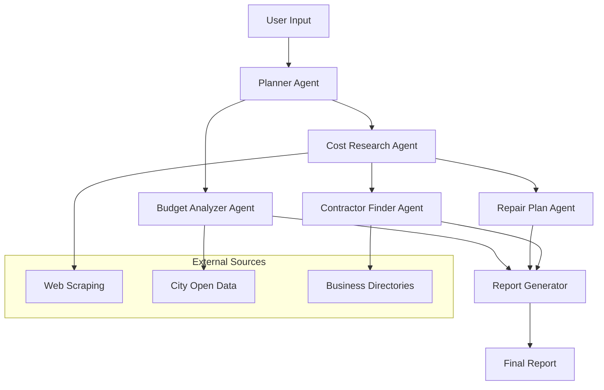

# Multi-Agent Infrastructure Reporting Workflow

## Overview

This document defines a 6-agent pipeline for generating public infrastructure repair reports. Each agent is a distinct FastAPI service component with defined inputs, outputs, and responsibilities. Each stage must utilize Gemini's API LLMs for gemini-3-flash-preview

## User Inputs

| Field | Type | Required | Description |
|-------|------|----------|-------------|
| `issue_type` | string | Yes | Infrastructure problem (pothole, streetlight, graffiti, sidewalk, signal, etc.) |
| `location` | string | Yes | City and state (e.g., "Chicago, IL") |
| `fiscal_year` | integer | Yes | Year of interest (e.g., 2025) |

---

## Workflow Architecture



---

## Agent Specifications

### Agent 1: Planner Agent

**Purpose:** Parse user input and generate structured tasks and search queries for downstream agents.

**Input:**
- `issue_type`: string
- `location`: string  
- `fiscal_year`: integer

**Output:**
```json
{
  "search_queries": {
    "cost_research": ["pothole repair cost Chicago 2025", "asphalt patching labor cost per square foot"],
    "contractor_search": ["pothole repair contractors Chicago IL", "local paving companies Chicago"],
    "budget_data": ["Chicago infrastructure budget 2025", "CDOT pavement repair allocation"]
  },
  "tasks_list": [
    {"agent": "cost_research", "priority": 1},
    {"agent": "budget_analyzer", "priority": 1},
    {"agent": "contractor_finder", "priority": 2},
    {"agent": "repair_plan", "priority": 2}
  ],
  "parsed_issue": {
    "category": "pavement",
    "subtype": "pothole",
    "severity_typical": "medium"
  }
}
```

**External Data Sources:** None (static logic)

---

### Agent 2: Cost Research Agent

**Purpose:** Research material, labor, and time costs for the specific issue type using web scraping. Web scrape websites like Lowes, Home Depot, Menards, and other construction and home goods websites

**Input:**
- `search_queries`: list of strings
- `issue_type`: string
- `location`: string

**Output:**
```json
{
  "material_costs": [
    {"item": "Hot mix asphalt", "unit": "per ton", "cost_low": 85, "cost_high": 120, "source": "regional_aggregates"},
    {"item": "Cold patch asphalt", "unit": "per bag", "cost_low": 18, "cost_high": 35, "source": "home_depot"}
  ],
  "labor_costs": [
    {"role": "Laborer", "hourly_rate_low": 25, "hourly_rate_high": 45},
    {"role": "Equipment Operator", "hourly_rate_low": 35, "hourly_rate_high": 60}
  ],
  "time_estimates": [
    {"task": "Small pothole repair (<2ft)", "hours_low": 0.5, "hours_high": 1.5},
    {"task": "Medium pothole repair (2-5ft)", "hours_low": 1.5, "hours_high": 3},
    {"task": "Large pothole repair (>5ft)", "hours_low": 3, "hours_high": 6}
  ],
  "total_cost_estimate": {
    "low": 150,
    "high": 450,
    "currency": "USD"
  },
  "sources": [
    {"url": "https://example.com/cost-guide", "accessed": "2025-01-15"}
  ]
}
```

**External Data Sources:**
- Web scraping: Home Depot, Lowe's for material costs
- Industry reports: Construction Cost Data
- Municipal bid sheets for labor rates
- Regional aggregate suppliers

---

### Agent 3: Repair Plan Agent

**Purpose:** Generate a general repair plan based on issue type and cost research.

**Input:**
- `issue_type`: string
- `location`: string
- `cost_estimates`: object from Agent 2

**Output:**
```json
{
  "repair_phases": [
    {
      "phase": 1,
      "name": "Site Assessment",
      "description": "Evaluate pothole depth, area, and surrounding pavement condition",
      "duration_hours": 0.5,
      "materials_needed": ["measuring tape", "core sample tool"],
      "prerequisites": []
    },
    {
      "phase": 2,
      "name": "Surface Preparation",
      "description": "Clean debris, remove loose material, square off edges",
      "duration_hours": 1,
      "materials_needed": ["jackhammer", "broom", "air compressor"],
      "prerequisites": ["phase_1"]
    },
    {
      "phase": 3,
      "name": "Patching",
      "description": "Apply asphalt patch material and compact",
      "duration_hours": 1.5,
      "materials_needed": ["asphalt mix", "compactor", "tamper"],
      "prerequisites": ["phase_2"]
    },
    {
      "phase": 4,
      "name": "Curing & Quality Check",
      "description": "Allow to cure, inspect for uniformity",
      "duration_hours": 0.5,
      "materials_needed": [],
      "prerequisites": ["phase_3"]
    }
  ],
  "recommended_method": "hot mix asphalt overlay for lasting repair",
  "alternative_methods": [
    {"method": "cold patch", "pros": "quick fix", "cons": "temporary", "best_for": "winter emergency repairs"}
  ],
  "permits_required": false,
  "safety_considerations": ["traffic control", "PPE required", "utilities clearance"]
}
```

**External Data Sources:** None (expert knowledge base)

---

### Agent 4: Contractor Finder Agent

**Purpose:** Find local businesses/contractors capable of performing the repair. Web scrape and use LLMs (Gemini) for searching local construction and contractor companies for gathering information.

**Input:**
- `search_queries`: list of contractor search queries
- `issue_type`: string
- `location`: string

**Output:**
```json
{
  "contractors": [
    {
      "name": "Chicago Paving Co.",
      "address": "123 Main St, Chicago, IL",
      "phone": "312-555-0100",
      "rating": 4.5,
      "review_count": 230,
      "services": ["asphalt repair", "pothole patching", "sealcoating"],
      "estimated_response_time": "2-3 days",
      "source": "yellow_pages"
    }
  ],
  "search_sources_used": ["yellow_pages", "yelp", "city_vendor_list"],
  "filters_applied": ["licensed", "insured", "active_in_area"]
}
```

**External Data Sources:**
- Yellow Pages API / web scraping
- Yelp business directory
- City vendor/pre-qualified contractor lists
- Better Business Bureau

---

### Agent 5: Budget Analyzer Agent

**Purpose:** Analyze the fiscal year budget for feasibility and allocation recommendations. Use Gemini LLM  and web scraping to search, anaylze and find allocations for the fiscal year budget for feasibility and allocation recommendations.

**Input:**
- `fiscal_year`: integer
- `location`: string
- `cost_estimates`: object from Agent 2

**Output:**
```json
{
  "fiscal_year": 2025,
  "budget_analysis": {
    "total_infrastructure_budget": 150000000,
    "allocated_to_issue_type": 8500000,
    "remaining": 14150000,
    "source": "Chicago Open Data Portal"
  },
  "feasibility": {
    "within_budget": true,
    "cost_as_percentage_of_allocation": 0.005,
    "recommendation": "proceed"
  },
  "recommendations": [
    "Request allocation from FY2025 pavement maintenance fund",
    "Consider bundling with adjacent repairs for bulk discount"
  ],
  "alternatives_if_over_budget": [
    {"option": "defer_to_next_fiscal_year", "reason": "not critical"},
    {"option": "request_emergency_allocation", "reason": "safety hazard"},
    {"option": "use_cold_patch_temporary", "cost_savings": "60%"}
  ]
}
```

**External Data Sources:**
- City Open Data Portal (budget data)
- Municipal budget PDFs/documents
- State transparency portals

---

### Agent 6: Report Generator Agent

**Purpose:** Synthesize all agent outputs into a final structured report. Use Gemini LLM

**Input:**
- All outputs from agents 1-5

**Output:**
```json
{
  "report_metadata": {
    "generated_at": "2025-01-15T10:30:00Z",
    "fiscal_year": 2025,
    "location": "Chicago, IL",
    "issue_type": "pothole"
  },
  "executive_summary": {
    "estimated_cost_range": "$150-$450",
    "recommended_timeline": "3-5 business days",
    "budget_feasible": true,
    "contractors_found": 5
  },
  "sections": {
    "cost_analysis": { ... },
    "repair_plan": { ... },
    "contractors": { ... },
    "budget": { ... },
    "sources": [ ... ]
  },
  "export_formats": ["markdown", "pdf", "html"]
}
```

**External Data Sources:** None (synthesis)

---

## FastAPI Integration

### New Route: `/api/v1/workflow/infrastructure-report`

**Request Model:**
```python
class InfrastructureReportRequest(BaseModel):
    issue_type: str = Field(..., description="Type of infrastructure issue")
    location: str = Field(..., description="City and state")
    fiscal_year: int = Field(..., description="Fiscal year for budget analysis")
```

**Response Model:**
```python
class InfrastructureReportResponse(BaseModel):
    report_id: str
    status: str
    progress: int  # 0-100
    result: Optional[dict]  # Final report when complete
```

### Agent Service Structure

```
backend/app/
├── agents/
│   ├── __init__.py
│   ├── base.py           # Abstract base agent class
│   ├── planner.py        # Agent 1
│   ├── cost_research.py  # Agent 2
│   ├── repair_plan.py    # Agent 3
│   ├── contractor.py     # Agent 4
│   ├── budget.py         # Agent 5
│   └── report_gen.py     # Agent 6
├── services/
│   ├── __init__.py
│   ├── web_scraper.py    # BeautifulSoup utilities
│   └── open_data.py      # City data API client
└── workflows/
    ├── __init__.py
    └── infrastructure.py # Orchestration logic
```

---

## Implementation Priorities

1. **Phase 1:** Core agents (Planner, Cost Research, Report Generator)
2. **Phase 2:** External integrations (web scraping, open data)
3. **Phase 3:** Advanced agents (Repair Plan, Contractor, Budget)
4. **Phase 4:** Report formatting (PDF, HTML exports)

---

## Dependencies to Add

```yaml
# New pip dependencies
beautifulsoup4==4.12.0
lxml==5.1.0
weasyprint==60.1  # PDF generation
jinja2==3.1.3     # HTML templating
aiohttp==3.9.0    # Async HTTP for APIs
```

---

## External APIs & Data Sources

| Source | Type | Purpose | Auth Required |
|--------|------|---------|---------------|
| City Open Data Portal | REST API | Budget data | No |
| Yellow Pages | Web Scraping | Contractor listings | No |
| Yelp | Web Scraping | Business reviews | No |
| Home Depot | Web Scraping | Material costs | No |
| Municipal websites | Web Scraping | Bid sheets, labor rates | No |
